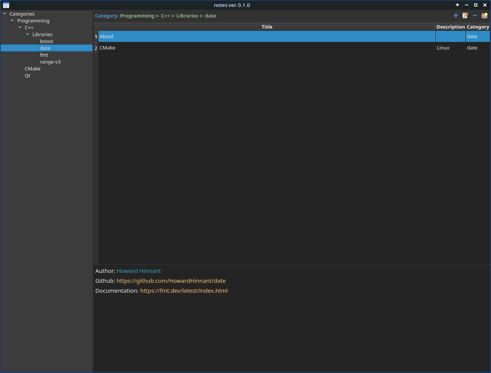

# notes
GUI desktop program for managing notes. 
The program is written in C++ and uses the Qt library as the GUI. 
This is my own implementation of a note management program. 
<b>But it's free and cross-platform</b>. 
I ran it on Linux and macOS, I don't know if it works on Windows (but I guess it should).

### Basic properties:
<lu>
<li>Each note is assigned to a category.</li>
<li>The categories are organized in a tree format (left side of the program window).</li>
<li>Each category can contain an unlimited number of subcategories.</li>
<li>Each category can contain an unlimited number of notes (table on the right side of the window).</li>
<li><b>Notes can be moved between categories</b>.</li>
<li>All data is saved in an SQLite database.</li>
</lu>

### Main Window view:

